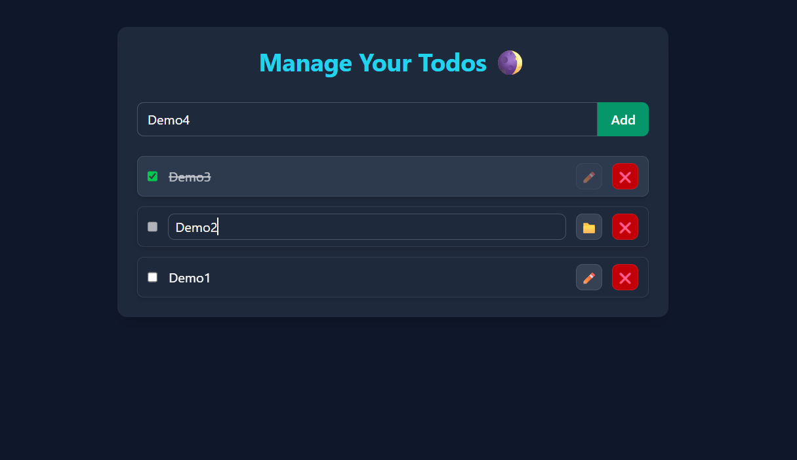

# 🌒 Dark Todo App

A simple and elegant Todo application built with **React** and **Tailwind CSS**, featuring:

- Add, edit, delete, and complete tasks ✅
- LocalStorage persistence 💾
- Fully responsive and clean UI ✨
- Context API for state management ⚙️

---

## 🔍 Preview

---

## 🚀 Demo

Live Demo 👉 [Vercel Link]()

---

## 🛠️ Tech Stack

- 🎨 **Tailwind CSS** – Fast and flexible styling with utility classes
- ⚛️ **React.js** – Builds the UI with reusable components
- 🌐 **Context API** – Manages global todo state
- 💻 **JavaScript (ES6+)** – Core logic and interactivity
- 💾 **LocalStorage API** – Saves todos in the browser
- 🛠️ **Node.js** – Dev environment base (via Vite + npm)
- ⚡ **Vite** – Super-fast React build tool
- 🧱 **HTML5** – Structure and layout foundation

---

## 💡 Features

- 🌑 Minimal dark-themed design
- 🧠 Context API used for global state
- 💾 Persistent tasks via `localStorage`
- ✍️ Inline task editing
- 🗑️ One-click delete
- ✅ Checkbox to mark complete

---

## 🙋‍♂️ Author

Made with ❤️ by [Swaraj Unde](https://github.com/swaraj-unde)

---
